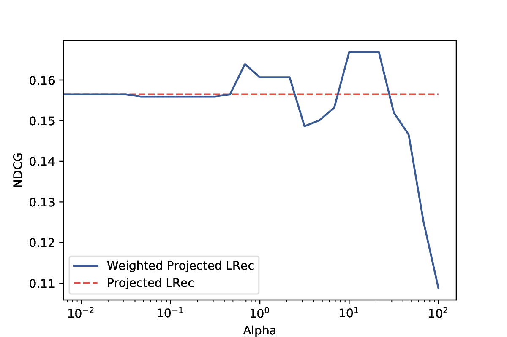
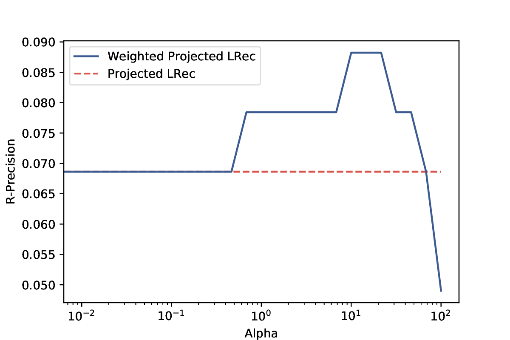

Weighted Projected LRec(AAAI-18)
================================

# Data
Movielens 1M,
Movielens 20M and
Spotify RecSys 2018 Competition Dataset.

Data is not suit to submit on github, so please prepare it yourself. It should be numpy npy file directly 
dumped from csr sparse matrix. It should be easy.. 

# Command for Movielens 1M
Process data
```
python getmovielens.py --implicit --random-split -r 0.3 -d datax/ -n ml-1m/ratings.csv --shape 6041 3953
```

Run Weighted Projected LRec
```
$ python main.py -i 4 -l 1.0 -r 100 -a 10 -m WPLRec -d datax/ -t Rtrain.npz -v Rvalid.npz -k 10
```

# Run-time
This model needs only 3 mins to process MovieLens 20M!

# Result
Note: reproduce this result is easy, but you need to tune the hyperparameter alpha to
see the improvement, since for even same dataset, the split of the dataset could cause
huge difference of the hyper-parameter requirement. We suggest to use 50% of the training
data to train and validation on the others. We also suggest to apply small alpha in order
to avoid poor generalization issue.
 
```
================================================================================
|                              Parameter Setting                               |
================================================================================

Data Path: datax/
Train File Name: Rtrain.npz
Valid File Name: Rvalid.npz
Algorithm: WPLRec
Mode: Item-based
Alpha: 10
Rank: 100
Lambda: 1.0
SVD Iteration: 4
Evaluation Ranking Topk: 10
================================================================================
|                                 Loading Data                                 |
================================================================================

Elapsed: 00:00:00
Train U-I Dimensions: (6041, 3953)
================================================================================
|                                Randomized SVD                                |
================================================================================

Elapsed: 00:00:01
================================================================================
|                          Create Cacheable Matrices                           |
================================================================================

Elapsed: 00:00:00
================================================================================
|                           Item-wised Optimization                            |
================================================================================

100%|██████████████████████████████████████| 3953/3953 [00:17<00:00, 223.06it/s]
Elapsed: 00:00:17
================================================================================
|                               Save U-V Matrix                                |
================================================================================

Elapsed: 00:00:00
================================================================================
|                                Create Metrics                                |
================================================================================

100%|██████████████████████████████████████| 6041/6041 [00:08<00:00, 694.76it/s]
-
NDCG :0.182108679494
R-Precision :0.078431372549
Clicks :0.0
Elapsed: 00:00:08

```

Effect of Weighting
===================
The following result shows Weighted Projected LRec outperforms Projected LRec when
 using reasonable hyper-parameters.

To reproduce this result, run
```
python experiment_weighting.py -d datax/ -t Rtrain.npz -v Rvalid.npz
```

 <!-- .element height="50%" width="50%" -->
 <!-- .element height="50%" width="50%" -->
